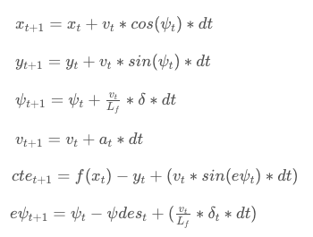
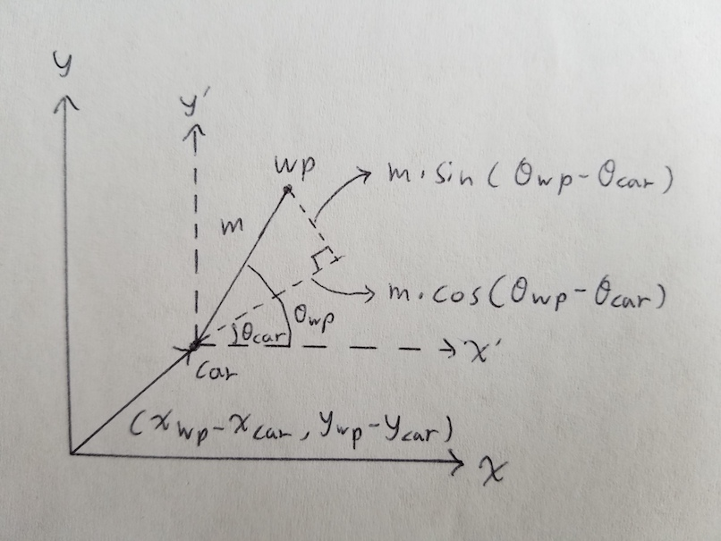

# CarND-Controls-MPC
Self-Driving Car Engineer Nanodegree Program

---

## Background

This project aims to drive the car around the track in the Udacity [simulator](https://github.com/udacity/self-driving-car-sim/releases) by leveraging PID control loop.

The following **states** are provided by the simulator at every communication instance:
- **Way Points**: The upcoming centers of the track in meters
- **Car Location**: The car location in the world coordinate in meters
- **Car Orientation**: The car orientation in the world coordinate in [0, 2*PI]
- **Car Speed**: The speed of the car in mph
- **Steering Angle**: The current steering angle of the car in radian

The following **actuations** are given to the simulator by the MPC model:
- **Steering Angle** Positive for turning to the left and vice versa in [-1, 1], corresponding to [-25, 25] degrees.
- **Throttle/Brake**: Positive for throttle and negative for brake in [-1, 1]

The core idea of model predictive control (MPC) is to leverage the knowledge of vehicle dynamics to optimize actuation in a finite time-horizon. At each instance only the current actuation is applied but optimizing for both present and future allows MPC to anticipate future events. PID control does not have this predictive capability. 

## Optimization Model

###Vehicle dynamics:

###Actuation limits:
- The steering angle is limited to [-25, 25] degrees
- Brake/Throttle is limited to [-1, 1] (100% brake/100% throttle) (We don't know what acceleration in m/s^s this correspond to)

###Cost:
- **Error**: Cross Track Error, orientation error, and speed error. These errors encourages the model to stay on desired track and speed.
- **Actuation**: The amount of actuation being used. This aims to achieve the optimal path with minimal amount of actuation being used.
- **Actuation Delta**: The rate of actuation change. This avoid erratic actuation being applied to upset the vehicle.

###Finite time-horizon:
The extend of future to be optimized is being controlled by time step **dt** and number of time steps **N**.

###Optimization:
**Ipopt** is used to minimize the cost using the actuation under the constraint of vehicle dynamics and actuation limits in the finite time-horizon.

## Hyper-parameters Tuning

###Cost Factor
As different cost items have different units, it is necessary to adjust the proportion of each cost item so one does not overwhelm another. Also the factor can be adjusted to achieve the desired driving behavior (sporty/smooth/etc.).

The followings are the cost magnification factor:
- **Orientation Error**: The orientation error is magnified **400** times as at high speed small orientation error leads to large CTE in short amount of time causing instability.
- **Steering amount**: The steering amount is magnified **100** times to discourage applying large steering angle as large steering carries higher risk to go off track.
- **Steering delta**: The steering delta is magnified **1000** times as erratic steering can upset the vehicle and causes fish-tailing.
- **Throttle/Brake delta**: Throttle/brake delta is **removed** as we want to brake/throttle as hard as we can into/out of the corner to carry the max speed around the track. 
- The rest of cost items are left unchanged.

###Time Horizon
Tuning N and dt allows us to determine how far to look ahead and how much resolution to use in the optimization calculation.
- **Length of future prediction**: This controls the trade-off between long term and short term cost. For example the car should not sacrifice stability for turns that are more than a few seconds away, but at high speed there is a need to anticipate braking time before a sharp turn occurs.
- **Resolution of future prediction**: This controls the trade-off between coping with fast changing events and computation power required. In this particular track curves happen rather smoothly while delay in response can cause tracking instability, so lower resolution is preferred. However in places where frequent actuation is required (Moose Test, Slalom, etc.) we would want to spend more computation power to cope with fast changing trajectory.

**N=10** and **dt=0.1** are used to plan only for 1 second ahead and to keep response latency low. 

## Other Features/Enhancements
###Mapping world coordinates to Vehicle coordinates
The model works off vehicle coordinate while the simulator returns way points in world coordinate. It is necessary to map each way point for the model to consume. The equation I derived (**Trigonometry!**):

###Coping with 100ms latency
We can treat the initial state as if it is **100ms later** according to the vehicle dynamics we have. To keep the equation simple I made two assumptions:
1. The steering angle has little effect on the x and y position in such short amount of time.
2. The acceleration has little effect on the speed of the vehicle in such short amount of time (after all we don't know the actual acceleration in m/s^2).

So the initial car location becomes **(v * latency, 0)** and psi, cte, and epsi can be calculated from there. 

###Braking before corner
Even though the tire seems to have **infinite amount of traction**, the car is least stable around the curve so to achieve high speed it is necessary to slow down before the curve. To anticipate curve I calculate the slope from the polynomial 60 meters ahead and lower the desired speed accordingly.

## Example

  

Full video can be found [here](https://youtu.be/BIWhmaCRS7Q)

## Other Notes
1. The better we can incorporate the vehicle dynamics the better the MPC works. In real world situation we would want to get all the dynamics right down to things such as air resistance and steering delay due to suspension.
2. There is limit using parametric equation to model the desired path. For example curves like J turn can be hard to model using polynomial. We can store way points directly and use interpolation for better accuracy at the cost of higher computation power.
3. Hyper parameter tuning can be done using numeric optimization technique to achieve better vehicle behavior.